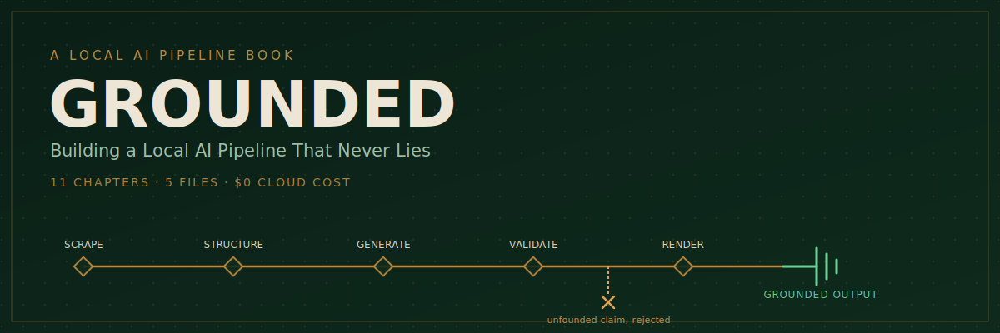

  

# Grounded

### Building a Local, Hallucination-Free AI Pipeline

You own a Raspberry Pi (or any modest home machine). You've heard of local LLMs like Ollama. You want to build something real with AI — not just chat with it in a browser.

This book walks you through building a complete, five-stage local AI pipeline: scrape real sources, feed grounded context to a local model, validate every generated claim against its source, and render the result into a finished, postable artifact. All on your own hardware. Zero cloud API cost. Zero invented facts slipping through.

By the end, you won't just understand how grounded AI pipelines work — you'll have one running on your own machine, ready to adapt to any niche you care about.

---

## Table of Contents

| # | Chapter | Description |
|---|---------|-------------|
| 1 | [The Hallucination Problem](chapters/chapter-01-the-hallucination-problem.md) | Why an LLM without grounding and validation is a liability generator, not a content tool. |
| 2 | [Choosing and Installing Your Local Model](chapters/chapter-02-choosing-and-installing-your-local-model.md) | Matching a model to your hardware and task instead of chasing the trending name. |
| 3 | [Talking to Your Model in Code, Not Chat](chapters/chapter-03-talking-to-your-model-in-code-not-chat.md) | Moving from the chat window to scripted API calls — the foundation of a repeatable pipeline. |
| 4 | [Gathering Real-World Source Material](chapters/chapter-04-gathering-real-world-source-material.md) | Disciplined, targeted scraping of a few good sources instead of bulk-downloading the internet. |
| 5 | [Turning Raw Scrapes into Usable Context](chapters/chapter-05-turning-raw-scrapes-into-usable-context.md) | Cleaning and chunking scraped text — the invisible step that determines grounded vs. garbage. |
| 6 | [Prompting for Grounded, Structured Output](chapters/chapter-06-prompting-for-grounded-structured-output.md) | Writing prompts that force the model to point back at its source, not just answer fluently. |
| 7 | [Building the Citation Validator](chapters/chapter-07-building-the-citation-validator.md) | The validation layer that rejects any claim that can't be matched back to source text. |
| 8 | [Turning Text into a Finished Artifact](chapters/chapter-08-turning-text-into-a-finished-artifact.md) | Rendering generated text into a shareable image, card, or post ready to publish. |
| 9 | [Wiring the Five Files Together](chapters/chapter-09-wiring-the-five-files-together.md) | Strict separation between scrape, structure, generate, validate, and render — each file with one job. |
| 10 | [Automating the Pipeline](chapters/chapter-10-automating-the-pipeline.md) | Turning a working single run into a scheduled, monitored process. |
| 11 | [Adapting the Pipeline to Your Own Niche](chapters/chapter-11-adapting-the-pipeline-to-your-own-niche.md) | Swapping the scrape target and prompt to reuse the same skeleton for any topic. |

> **Status:** Chapter 1 is available now. Remaining chapters are in progress and will be added to the `chapters/` folder as they're completed.

---

## What You'll Build

By the end of this book, you'll have five working files that form a complete pipeline:

1. **Scrape** — pull real source material from the web
2. **Structure** — clean and chunk it into usable context
3. **Generate** — prompt your local model for grounded, structured output
4. **Validate** — reject any claim that can't be traced back to a source
5. **Render** — turn validated text into a finished, postable artifact

No cloud APIs. No subscription costs. No hallucinated facts.

## Requirements

- A Raspberry Pi or similar modest home machine (a laptop works too)
- [Ollama](https://ollama.com) or another local LLM runtime
- Basic comfort with the command line (no prior scripting experience required — the book teaches it)

## License

See [LICENSE](LICENSE) for details.
